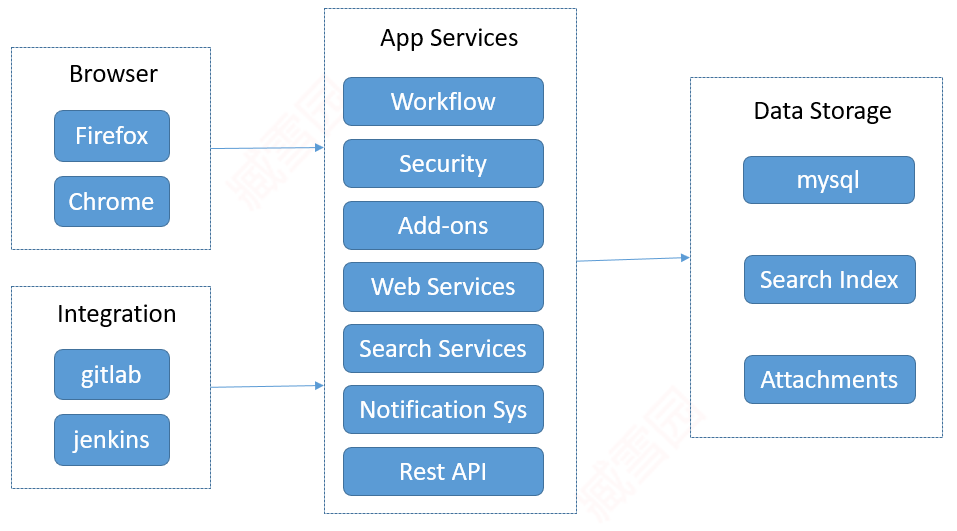

[TOC]

### 1. Jira 架构

Atlassian官方提供了Jira 体系架构的全命概述：https://developer.atlassian.com/server/jira/platform/architecture-overview/
所提供的信息乍一看可能是庞大复杂难以理解的。所以我们大概总结如下：

#### （1）Web浏览器

Jira是一个web应用程序，所以用户不需要在他们的机器上安装任何东西。他们所需要的只是一个与Jira兼容的web浏览器。

#### （2）应用服务

应用程序服务层包含Jira提供的所有功能和服务。这些服务包括各种业务功能，例如工作流和通知，`REST/Web Service`等其他服务。

#### （3）数据存储

数据存储层将持久数据存储在Jira中的多个位置。大多数业务数据(如项目和问题)都存储在关系数据库中。上载的附件和搜索索引等内容存储在JIRA_HOME目录的文件系统中.

>[success] 基础关系数据库对用户是透明的，您可以轻松地从一个数据库迁移到另一个数据库: https://confluence.atlassian.com/adminjiraserver/switching-databases-938846867.html

### 2. 术语

#### （1）项目

项目，这里指的是通过 问题，kanban或 Scrum 等组件资源组合起来，在给定的时间内完成一项独立的工作任务。比如说以下都称为一个项目：

- 开发一个新产品
- HR
- 公司内部事务

#### （2）Kanban

Kanban，是一个日语词，来源于TPS丰田生产系统，是实现拉动生产的有效工具，中文的资料中经常会以汉字“看板”的形式出现，以便于读者阅读。

把工作细分成任务，写在卡纸上，贴在墙上，把栏命名好，來显示任务在工作流程中的狀況。

#### （3） Scrum

Scrum源自于橄榄球的一种争球方式。现在作为一种迭代式增量软件开发过程，通常应用于敏捷软件开发。Scrum将工作分解成较小的功能单元，并在周期性固定的时间段内持续的交付。

#### （4）问题

问题是 Kanban 和 Scrum 的主要组件，它推动了整个流程的进行。

#### （5）字段

多个字段构成了一个完整的问题。

### 3. Jira 家目录

Jira 主目录包含特定于每个Jira实例的关键数据和配置文件.

JIRA_HOME目录可以在系统的任何位置创建，甚至可以在共享驱动器上创建，但是它不能是JIRA_INSTALL的子目录。建议使用具有低网络延迟的快速磁盘驱动器，以便从Jira获得最佳性能。

这种数据和应用程序的分离使维护和未来升级等任务变得更加容易。在JIRA_HOME中，有几个包含重要数据的子目录，如下表所示:

| 目录  | 描述  |
| ------------ | ------------ |
| data  | 该目录包含未存储在数据库中的数据，例如上载的附件文件。  |
| export  | 该目录包含Jira创建的自动备份存档。这与用户执行的手动导出不同。手动导出要求用户指定将存档存储在何处。  |
| import  | 目录包含可以导入的备份。Jira将仅从该目录加载备份文件。  |
| log  | `atlassian-jira.log` ：有关Jira软件和Jira Core应用程序的信息,`atlassian-servicedesk.log` ：有关Jira Service Desk应用程序的信息,`atlassian-jira-security.log` ：有关用户会话，登录和注销的信息  |
| plugins  | 此目录是已安装插件（也称为附加组件）的存储位置。  |
| caches  | 该目录包含Jira用于在运行时提高其性能的缓存数据。例如，搜索索引存储在此目录中。  |
| tmp  | 该目录包含在运行时创建的临时文件，例如文件上载。  |

当Jira运行时，JIRA_HOME目录被锁定。

Jira通过编写一个名为`Jira-home.lock`的临时文件来锁定JIRA_HOME目录。锁定到目录的根目录中。在关机期间，该文件将被删除。但是，有时Jira可能无法删除这个文件，例如在不适当的关闭期间，您可以手动删除这个锁定的文件来解锁目录，以便再次启动Jira。