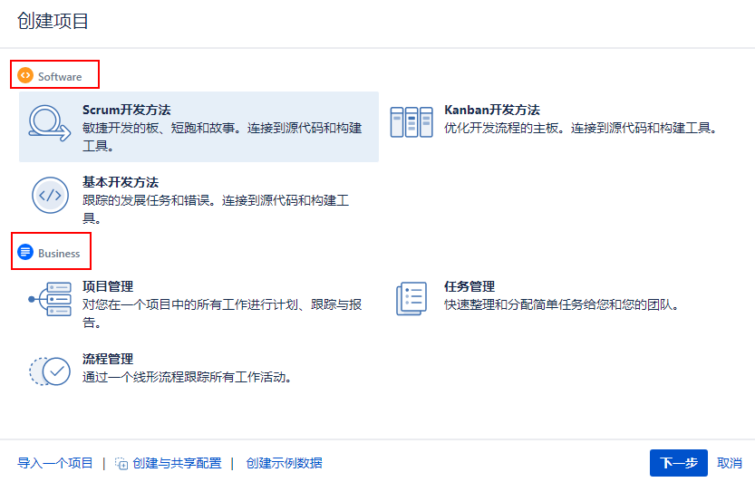
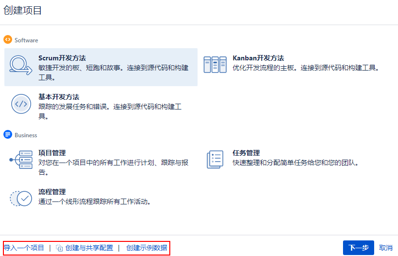

[TOC]

### 1. 项目类型

项目类型定义项目可用的特性，以及用于在项目中显示信息的用户界面。每个项目类型还附带一个或多个模板，以及一组预定义的配置，以帮助您快速入门。下面的截图显示了一个开箱即用的Jira软件安装的项目类型及其模板:

从上图中，可以看出，有两种类型的项目类型：

- Software

- Business

### 2. 创建项目

`顶部菜单栏` -> `Create project` -> `选择模板(我们的示例选择 Task management)` -> `项目的详细信息`

- 导入一个项目：这允许您从另一个兼容的问题跟踪系统或数据导出(如Bugzilla、GitHub或CSV文件)导入数据到一个新的或现有的Jira项目中。

- 创建与共享配置：这允许您基于现有项目的配置创建新项目。

- 创建示例数据

### 3. 改变项目 key 格式

在创建新项目时，您可能会发现项目键需要具有特定的格式和长度。默认情况下，项目key需要遵循以下标准:

- 它应该包含至少两个字符
- 最长不能超过10个字符
- 它仅只能包含符--也就是说

您可以更改默认格式以减少限制规则。

#### （1）更改项目 key 的长度

`System` -> `General configuration` -> `Edit Settings` -> `Maximum project key size` -> `update`

#### （2）更改项目 key 格式

`System` -> `General configuration` -> `Advanced Settings` -> `[A-Z][A-Z]+`

可以更改为：`[A-Z][A-Z0-9]+`

以下是设置项目密钥格式的一些规则:

- 钥匙必须以字母开头
- 所有字母必须大写，即[A-Z]
- 只能使用字母、数字和下划线字符
- 新模式必须与所有现有项目兼容