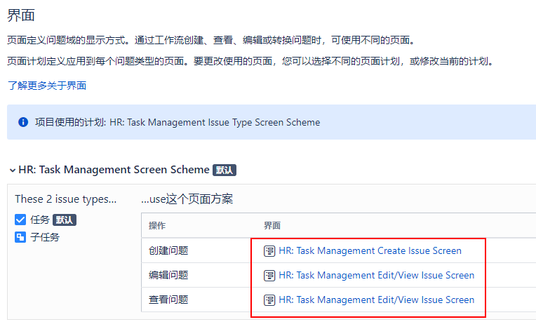
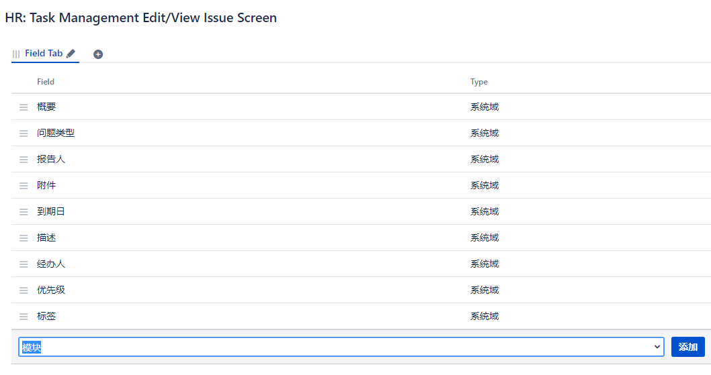
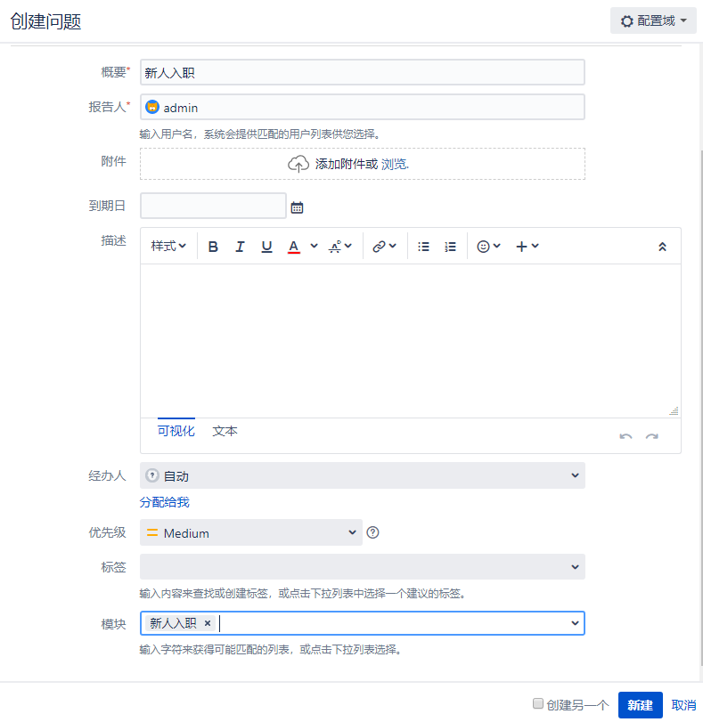

[TOC]

任务管理项目主要用于执行一次性任务，比如：

- 新人入职招聘
- 公司电脑维修

下面我们将创建一个 `Human Resource` 的项目给 HR 团队。

### 1. 创建一个用户

用户名：hr01 ，mail: hr01@aishangwei.net

### 2. 创建项目

项目名称：Human Resource

### 3. 创建模块

创建模块的用处：可以自动的进行分配`经办人`。让专业的人做专业的事情。

项目设置 -> 模块 ->

名称：新人入职
描述：新人入职流程办理
经办人：hr01

### 4. 把模块加入问题中

项目管理 -> 界面

分别点击这三个问题，把 `模块` 添加进去

### 5. 创建问题

点击顶部 -> 新建

自动的分配了经办人 hr01