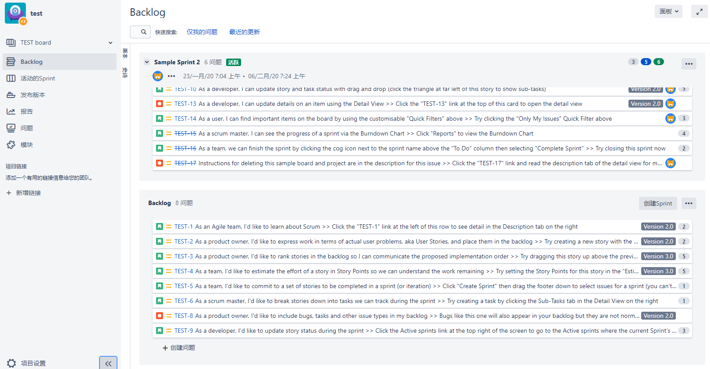
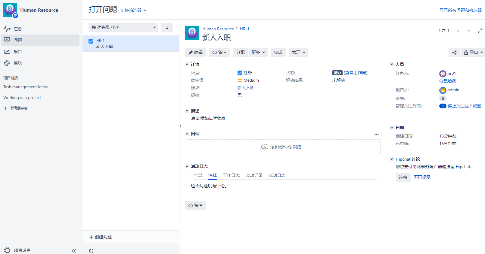
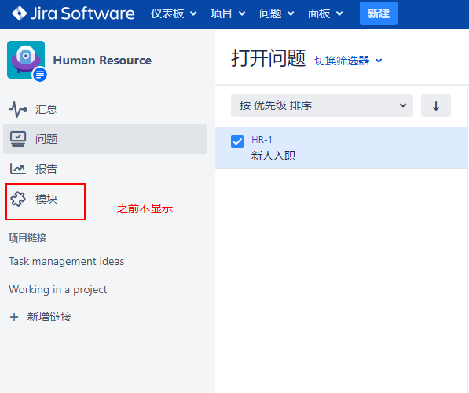

[TOC]

### 1. 项目用户界面

Jira 中有两个不同的项目接口：

一个针对于日常用户设计的，含有报告，统计信息和敏捷性有关的信息。称为 `项目浏览界面`
另外一个是针对项目管理员设计，例如权限和工作流程等，称为 `项目管理页面`。

### 2. 项目浏览页面

项目浏览页面是大多数用户会使用的页面，实际的项目浏览页面取决于项目类型，因此所显示的内容也不尽相同。

#### （1）Scrum 项目

#### （2）任务类的业务项目

>[warning]需要注意的是：版本和模块只有在项目中使用的时候，才会显示这两个选项。

### 3. 项目管理页面

在之前的版本当中，工作流和优先级等配置属于系统级配置，从 7.3 开始，并入了项目管理配置。

左下角 -> 项目设置

具体能操作的选项参看实际页面。

>[info] 如果不是 jira 管理员，您可能只能查看当前项目的配置。