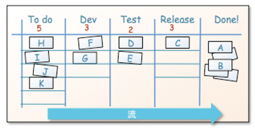
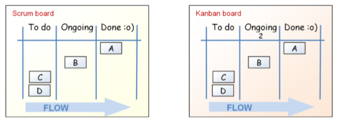
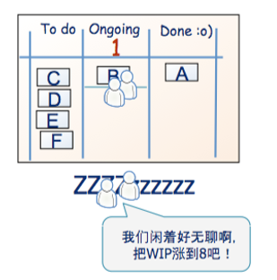
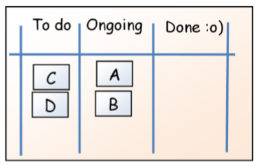
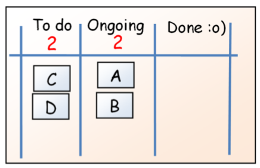
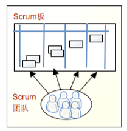
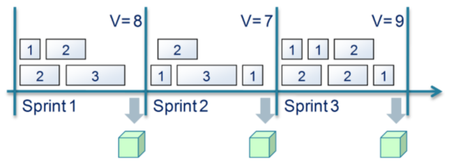

[TOC]

Jira Software 产品支持两种敏捷软件开发方法：Scrum 和 kanban，如果对这种敏捷方法不是很熟悉，可以参考：https://www.infoq.com/minibooks/kanban-scrum-minibook/

### 1. Scrum

使用 Scrum ，一个项目被分为多个迭代，迭代也称为 sprint，每个迭代持续1到四周的时间，目的是最终开发出经过全面测试且可以交付的产品。

在每次迭代开始时，产品负责人和团队将一起参加所谓的迭代计划会议，确定下一个迭代的范围，这通常包括积压（backlog）中的所有优先事项，其中包含所有未完成的工作。

在每次迭代期间，团队成员每天开会，审查进度并标记出任何潜在的问题或障碍，并计划如何解决这些问题。这些会议通常很短。

在迭代结束时，团队将聚在一起检查迭代的结果，并查看他们做对的事情和不顺利的事情，目的是确定需要改进的地方，这将影响未来的迭代。这个过程一直持续到项目完成为止。

### 2. Kanban

kanban 与 Scrum 不同，后者以迭代方式运行，而看板更多地关注交付实际执行。它非常强调从开始到结束可视化交付工作流，通过控制每个阶段允许多少工作项来对工作流的不同阶段进行限制，并度量交付时间。

使用看板，能够直观地看到工作项通过工作流，识别低效和瓶颈的区域，并纠正它们。这是一个连续的过程，工作从一端进来，从另一端出去，确保工作尽可能高效地进行。

### 3. scrum 和 Kanban pdf讲解

#### 3.1 Scrum 和 Kanban 概述

##### （1）Scrum 简述

参考 17 页

- 把组织拆分成小规模的，跨功能的自组织团队
- 把工作拆分成一系列小而具体的交付物。按优先级排序，估算每项任务的相对工作量
- 把时间拆分成固定大小的短迭代（通常为1-4 周），在每个迭代结束时对基本可 以交付的代码进行演示。
- 在每个迭代结束后跟客户一起检查发布目标，并据此优化发布计划，更新任务 优先级。 每个迭代结束后进行回顾，进行过程优化。

总结：用小团队在短时间内做出小块的东西来，在有规律的集成中组装出全貌。

##### (2) Kanban 简述

- 流程可视化：
	- 工作拆分成小块，一张卡片写一件任务，再把卡片放到墙上。
	- 每一列都起一个名字，显示每件任务在流程中处于什么位置。
- 限制 WIP（在制品，work in progress）──明确限制流程中每个状态上最多同 时进行的任务数。
- 度量生产周期（完成一件任务的平均时间，又称循环周期），对流程进行调 优，尽可能缩短生产周期，并使其可预测。

#### 3.2 Scrum 和 看板有什么关系?

##### (1) Scrum 和 看板都是过程工具

- 过程：工作方式
- 工具：用于完成任务或达成目的的任何东西

##### （2）Scrum 和看板各有优点

两种工具都各有优点，但也都不是更完美的。它们没有把需要做的事情全都告诉你，只是给了一些明确的约束和指导。

##### （3）Scrum 比 看板更规范

规范性指的是：遵守更多的规则
适应性：要遵守的规则较少

敏捷方法有时被称作 轻量级 方法,主要原因就在于它们不如传统方法那么规范。敏捷 宣言的第一条就是“个体和交互胜过过程和工具”。

Scrum 和看板都是适应性很强的，但相对而言，Scrum 更规范一些。Scrum 多了些约 束，少了些选择。比如Scrum 要求使用有固定时长的迭代，但看板没有。

##### （4）别把自己绑在一种工具上

根据自己的需求，可以相互搭配使用，比如 Scrum 和 Kanban 共同搭配。

参见示例：https://cloud.tencent.com/developer/article/1067355

#### 3.3 Scrum 规定了角色

Scrum 规定了三种角色：产品负责人（描绘产品远景，定义优先级）、团队（实现 产品）、Scrum Master（消除障碍，带领过程运作）。

看板没规定任何角色。

这可不是说你不能或是不应该在看板里有产品负责人的角色。这只是说你不是 非有 不可 。不管是用看板还是Scrum，你都可以根据需要增加任意角色。

#### 3.4 Scrum 规定了固定时长的迭代

固定时长的迭代是 Scrum 的基础。你可以选择迭代长度，但一般都会在一定时间内 让迭代长度固定不变，继而形成节奏。

看板没有规定固定时长的迭代。你可以选择什么时候做计划，什么时候改进过程， 什么时候发布。你还可以选择是有规律的采取行动（如每周一发布），还是按实际 需要进行（如有了有用的东西之后就发布）。

#### 3.5 看板和Scrum 的 WIP 限制

看板按流程状态限制 WIP，Scrum 按迭代限制 WIP。

Scrum 的 Sprint backlog 显示了当前迭代（迭代也就是 Scrum 术语中的 Sprint）要完 成哪些任务。它们一般都用墙上的卡片展示，被称作Scrum 板（Scrum board），或 是任务板（Task board）。

Scrum 板和 看板图 有什么区别呢?用个简单的小项目比较一下：

两个板都使用相同的状态。区别在于 kanban 有个数字 2，代表这列最多有两个任务。

而 Scrum 这没有这种限制，你可以把4个任务都放到一个列中，你肯定没办法放5个，因为整个板上也就有4个（这是这次 sprint 的总任务数）。

所以，Scrum 和看板都是限制 WIP 的，只是方式不同。Scrum 团队通常都要度量 生 产率 ──每个迭代能完成多少条任务（或是用相应的单位表示，如“故事点”）。一旦 他们知道了自己的生产率，这个数值就成了 WIP 的上限（或者至少是个参考值）。 平均生产率是10的团队一般不会在一个Sprint 里面放进超过10张卡（或故事点）。

- Scrum 的WIP 按单位时间限制。
- 看板的WIP 按流程状态限制。

#### 3.6 两者都是经验主义的

Scrum 和看板都是经验主义的产物，你用的时候需要先进行试验，然后根据自己的 环境作调整。实际上，你 必须 得先试验。Scrum 和看板都没给出一切问题的答案， 它们只是给了一些基本约束，以此驱动过程改进。

**例子：看板中的 WIP 上限试验**

参考：31页

#### 3.7 Scrum 在迭代内拒绝变化

假设我们有一块这样的 Scrum 板

如果有人跑出来要把E放上去会怎么样？

Scrum团队一般会说， “对不起，这样不行。我们已经承诺了这个sprint要做完A+B+C+D。 不过你可以把它放到产品backlog 里面。如果产品负责人觉得它优先级很高的话，我 们会从下一个 sprint 开始做。

要是换成看板团队，他们会怎么说？

他们会说“请把E放到To Do那一列上。但那一列的限额是2，所以你得把C 或者D 去掉。我们现在在做 A 和 B，只要腾出手来，我们就会把 To Do 顶上的卡片拉过来 做。“

#### 3.8 Scrum 板在迭代之间重置

Scrum 的 Sprint 只有把全部任务结束后，才会进行下一个迭代。
看板的样子几乎是一成不变的，板上一直有任务存在。

参考：36页

#### 3.9 Scrum 规定了跨功能团队

一个 Scrum 团队只有一块 Scrum 板。Scrum 团队是跨功能的，要完成迭代全部任务 所需的技能，这个团队要全都具备。Scrum 板对所有感兴趣的人全都是可见的，但 只有它的所属Scrum 团队才能编辑──这是他们管理迭代承诺的工具。

也就是说，由于 Scrum 团队拥有完成整个工作流的所有技能（功能），所以它可以进行权限的控制，只需允许某些人进行某些状态的操作。

看板不强制要求跨功能团队，看板图也不是独归某个团队所有。看板图对应的是流程，不必非得是一个团队。

参考：37页

#### 3.10 Scrum 的 backlog条目必须能跟 Sprint 搭配的上

Scrum 和看板都以增量开发为基础，即将工作拆分成小块。

参考 38 页

#### 3.11 Scrum 规定了估算和生产率

在Scrum 里面，团队要对每个承诺的任务估算其相对大小（=工作量），到迭代结束 的时候，把每个任务的大小相加，就得到了生产率。生产率是度量团队能力──我们 每个Sprint 能交付多少东西──的指标。下面是平均生产率为8的一个例子。

看板没有规定估算这回事。所以如果需要作承诺的话，就得想一想怎么作预测了。

#### 3.12 二者都允许在多个产品上并行工作

参考：40页

#### 3.13 二者都是既精益又敏捷

参考 42页

#### 3.14 小小差异

Scrum 规定了经过优先级排序的产品 backlog
Scrum 规定了每日立会
Scrum 规定了燃尽图

#### 3.15 Scrum 板 和 看板图例子

参考： 46页