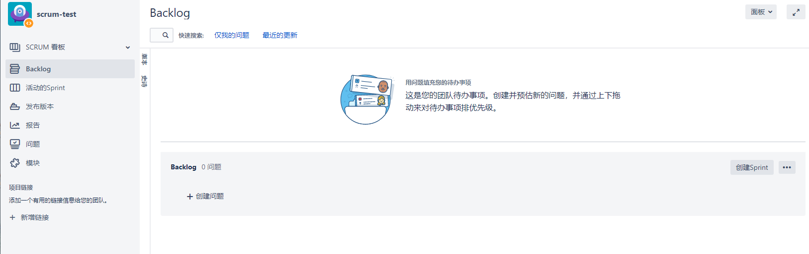
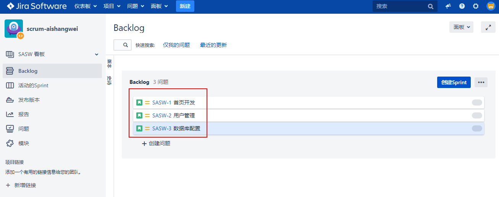
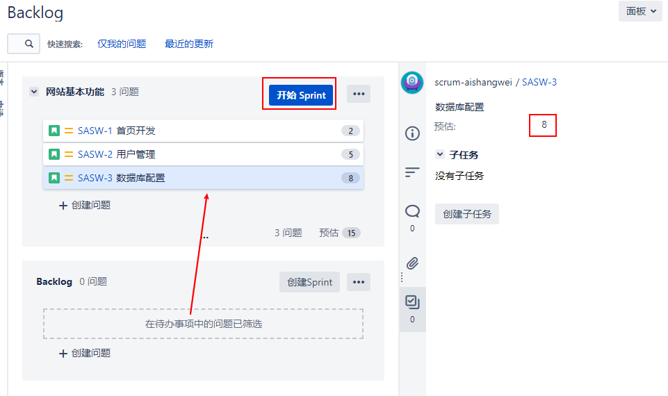
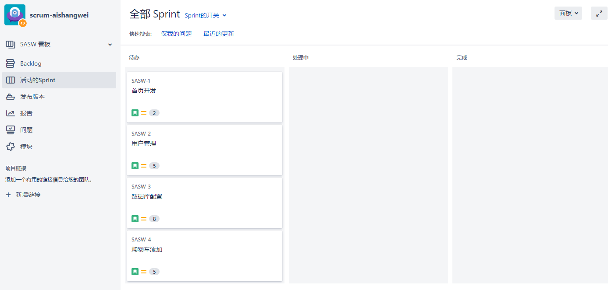
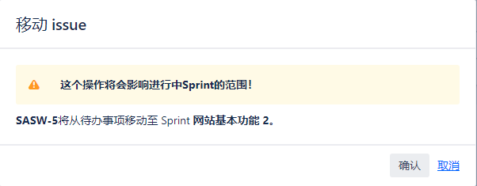
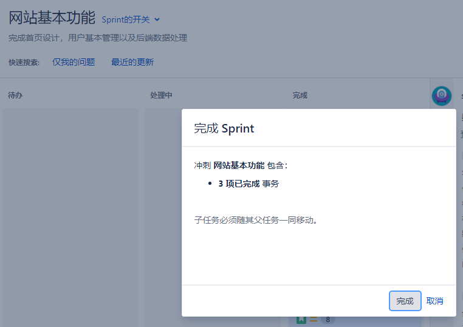

[TOC]

### 1. 创建一个 Scrum 项目

创建项目 -> Scrum开发方法 -> 名称：scrum-aishangwei

创建 Scrum 项目之后，自动进入到 Backlog 页面。

该 Scrum 界面包含以下主要部分：

- Backlog：这是所有计划外问题的存储位置。您可以将其视为待办事项。

- 活动的sprint：这个视图显示了当前正在进行的sprint以及sprint的一部分问题。

- 报告：此视图包含许多用户报告，可以根据团队的性能生成这些报告。

### 2. Backlog 怎么工作

backlog是您的项目的待办事项列表，是您保存所有未完成特性(通常以故事的形式表示)的地方。当您第一次开始时，您可能有一个空的backlog，所以第一步是产品负责人和团队一起工作，用需要完成的故事和任务填充它。

#### （1）确定工作的优先级

在Jira中，对待办事项中出现的问题进行优先排序意味着通过拖拽的方式在待办事项中上下移动它们。

评估工作是Scrum的一个关键部分，你的迭代是否成功很大程度上取决于你和你的团队的评估能力。

避免这一缺陷的一种方法是使用一些称为故事点的任意估计，这是Jira中的默认估计方法。其背后的思想是基于问题的复杂性来度量和评估问题，而不是根据完成问题所需的时间。

然而，有时您可能会发现很难估计您的故事的复杂性。这通常是一个信号，表明您没有足够的关于这个故事的信息，或者这个故事的范围太大，需要分解。

既然我们已经确定了评估问题的方法，我们就可以继续了。

- 创建问题 -> 首页开发，用户管理，数据库配置等
- 从backlog中单击要评估的问题。
- 在预估字段中输入故事点的数量。

>[info]一旦问题被添加到活动sprint中，您不应该更改评估。在sprint中期更改评估可能会导致在spring计划阶段和未来的改进中出现错误的评估。

### 3. 创建一个 sprint

#### （1）创建一个 sprint

随着积压工作的填充和问题的评估，下一步是创建团队开始工作的sprint。要创建一个新的sprint，请执行以下步骤:

- 在 Backlog 页面，点击`创建Sprint`
- 把刚才创建的问题拖拽到新创建的 Sprint 中
- 点击`开始 Sprint` ,名字：`网站基本功能`， 周期一般1-4周

一旦sprint开始了，您可以转到active sprints视图，团队可以开始交付工作。

>[info]如果`开始 Sprint`为灰色，一般是由于已经有正在运行的 sprint,或者你没权限管理。

#### （2）创建一个并行的 sprint

如果您的团队比较大，您可以把他拆解为多个小团队来并行迭代，启用并行迭代的方法：

管理 -> 应用程序 -> Jira Software 配置

当你有并行的sprint时，由于active sprint视图一次只显示一个sprint，你需要在sprint之间切换

### 4. 运行 sprint

一旦团队确定了问题的优先级，并在sprint计划会议期间开始了sprint，将切换到active sprint视图。对于普通的团队，你将在任何时候都有一个活跃的sprint，你的SCRUMboard将如下图所示:

在SCRUM板子上，每个问题都被表示为一张卡片，板子本身由垂直的列组成，这些列代表问题可能处于的不同状态，它们被映射到项目使用的工作流中。

`board`也可以分成若干水平的行，称为泳道。

当一个sprint正在进行的时候，通过在sprint中添加更多的问题来避免范围蔓延是很重要的，Scrum管理者和产品所有者有责任确保团队不被任何障碍分心或阻碍。但是，有时会出现需要包含某些特性或修复的紧急情况，在这种情况下，您可以从backlog视图向活动sprint添加新问题。

但是请记住，这不应该成为一种常见的习惯，Jira会在你试图在sprint中添加更多问题时提示你，如下面的截图所示:

在 sprint 结束时，你需要完成以下 sprint:

- 进入到 活动的 sprint
- 点击`完成 Sprint`,来结束 sprint

一旦你在Jira中完成了一个sprint，任何未完成的问题都将被重新放到backlog中。

将sprint延长几天是很诱人的，因为你还有一个问题要完成。虽然这并不是一个严格的规则，但是您应该避免这样做，让未完成的问题回到backlog中，并在下一次sprint会议中重新确定优先级。这是因为Scrum是一个迭代的过程，我们的目标不是让每个人都尽可能地努力工作，而是能够回顾团队在上一个sprint中做对了什么和做错了什么，并在下一个sprint中加以解决。可能这是因为在需求收集过程中做出了不准确的估计或不正确的假设。这里的要点是，团队应该把这看作是一个改进的机会，而不是草草了事的失败。简单地扩展当前sprint以适应不完整的项目可能会变成一个滑坡，在那里扩展sprint的实践成为规范，而根本问题被掩盖了。