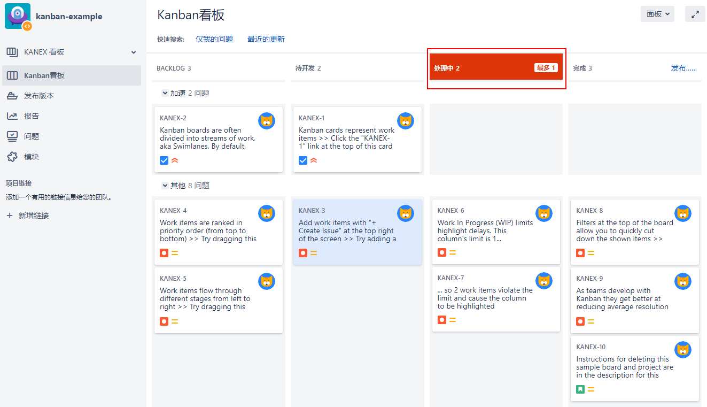
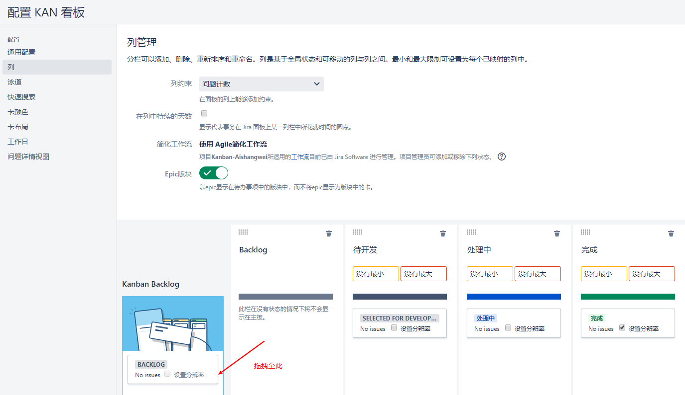

[TOC]

现在就该看看Jira software 支持的另一种敏捷方法— -- Kanban 。与Scrum相比，看板方法要简单得多。与Scrum不同的是，它有一个backlog，需要团队在sprint中对交付进行优先级排序和计划，而看板仅仅关注于执行和度量吞吐量。

在Jira中，一个典型的看板与SCRUM看板有以下不同:

- 默认情况下没有backlog视图。由于看板没有一个sprint计划阶段，你的看板就像积压的工作一样。我们将在后面几节中看到如何为看板启用backlog。

- 没有活跃的sprint。看板背后的思想是你有一个连续的工作流程。

- Scrum和看板有不同类型的报告，专门针对每种方法设计。

- 列可以有最小约束和最大约束。

- 如果违反约束，列将突出显示。，由于违反约束，被选中的用于开发和正在进行中的列都被高亮显示。

### 1. 创建一个 Kanban 项目

`创建项目` -> `Kanban开发方法` -> 名字：`Kanban-Aishangwei`

### 2. 使用 Kanban board

正如我们前面提到的，在看板中，默认情况下没有sprint计划，所以没有一个梳理backlog的视图，所有的事情都直接在看板板上发生。

让我们来看看看板的一个例子，如下面的屏幕截图所示，我们可以清楚地看到我们的流程在开发和测试阶段都存在问题。In Development用红色突出显示，这意味着我们有足够的工作，这是瓶颈的标志。在测试中是用黄色突出显示的，这意味着我们没有足够的工作，这是效率的标志:

有了这个，看板就可以直观地告诉我们哪里出了问题，这样我们就可以把注意力集中在这些问题上。

这就提出了一个常见的问题—我的列的正确约束应该是什么?快速的回答是，边做边试。

### 3. 为 Kanban board 开启 backlog

要将Scrum风格的待办事项列表添加到看板项目中，只需通过以下步骤将适当的状态映射到看板待办事项列表中:

- `Kanban看板` -> 右上角`面板`下拉菜单，选择`配置`

通过在看板待办事项列表中映射状态，您现在将拥有一个看起来和工作起来都像Scrum项目一样的待办事项列表，任何新创建的问题都将被添加到待办事项列表中，因为它们将处于待办事项列表工作流状态，如下面的截图所示:

您可以将多个状态映射到backlog。看板的另一个好处是，如果你有数百个问题，Jira以这种方式显示它们比在看板板上显示要快得多，效率也高得多，Jira 8对看板的性能有了显著的改进。