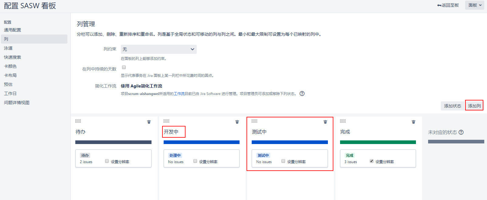
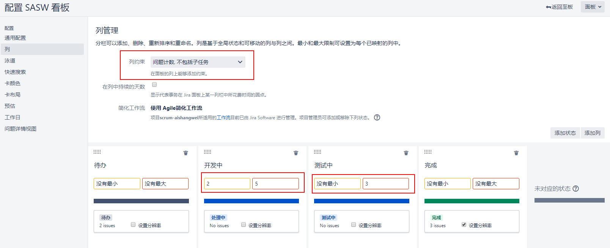
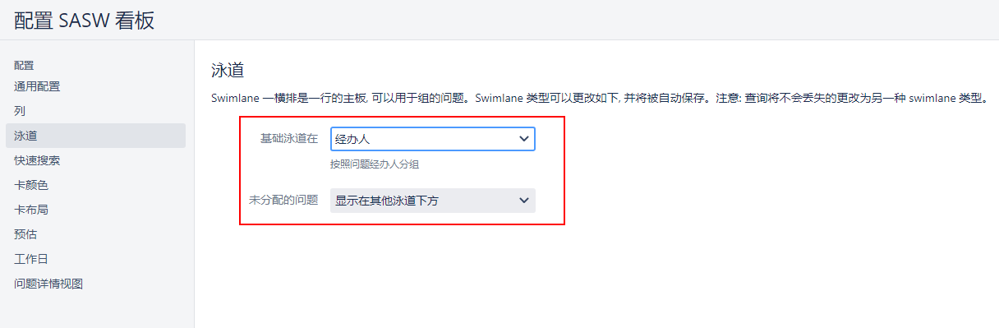
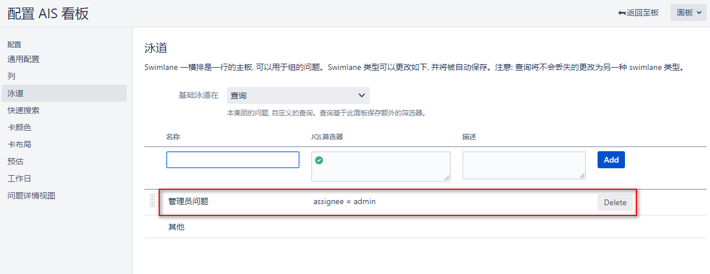
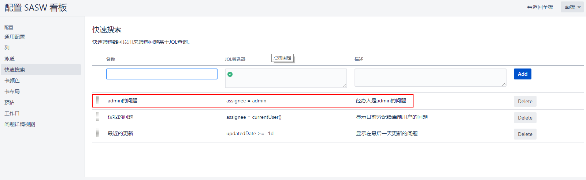
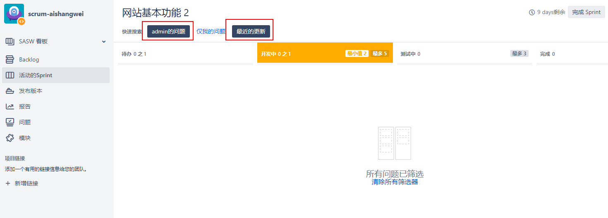

[TOC]

既然我们已经了解了如何使用Jira软件来运行Scrum和看板项目，让我们来看看如何定制我们的敏捷板。由于Jira software 构建在Jira core 之上，它的许多定制选项都利用了Jira的核心特性。

### 1. 配置列

对于Scrum和看板，board 的列都被映射到项目使用的工作流中，而创建的默认工作流非常简单。例如，默认的Scrum工作流包含三个状态——`To Do`, `In Progress`, and `Done`。然而，这通常是不够的，因为项目在开发周期中会有额外的步骤，例如测试和审查。要添加新列到您的 board，遵循以下步骤:

面板 -> 配置 -> 列

### 2. 设置列的约束

在前面的看板部分中，我们提到看板的一个关键方面是控制发送的工作量。

虽然工作约束是看板中使用的一个概念，但有时人们也会在Scrum中采用它。这使得你可以使用Scrum来规划，而使用看板来执行，这是一种叫做Scrumban的混合方法。

您不必同时设置约束的最小值和最大值。

在您为董事会设置了列约束之后，每当违反规则时，Jira都会立即在您的敏捷看板上提醒您。例如，我们在Selected For Development列中有两个问题，其中至少有三个问题，因此该列用黄色突出显示。在In Progress列中，我们有6个问题，由于它的最大限制是5个问题，所以该列用红色突出显示。

### 3. 配置泳道

正如我们在前面几节中看到的，Jira的敏捷板允许您将类似的问题分组在水平行中，称为泳道。与映射到工作流状态的列不同，您可以基于任何标准定义泳道，包括您自己添加的自定义字段。要为您的板设置泳道，您需要通过以下步骤:

面板 -> 配置 -> 泳道

当选择如何定义泳道时，有六个选项可供选择，如下表所示:

- `Queries`：泳道将基于您定义的Jira查询语言(JQL)查询。对于每个泳道，您需要定义JQL查询，该查询将返回泳道所需的问题。匹配多个查询的问题将只包含在第一个泳道中。

- `stories`：泳道将基于用户故事。属于同一故事的子任务将显示在相同的泳道中。

- `Assignees`：泳道将基于每个问题的受让人。具有相同受让人的问题将分组在相同的泳道中。我们在Scrum部分展示的示例Scrum board使用了这个选项。

- `Epics`：泳道将基于每个问题所属的史诗。同一史诗中的问题将被分组到同一泳道中。

- `Projects`：泳道将基于每个问题所属的项目。敏捷板可以包含来自多个项目的问题。

- `No Swimlanes`：敏捷板子将不会使用泳道，所以所有的问题都将集中在一行中。

正如我们在下面的截图中看到的，我们使用了Queries选项，并且我们已经定义了一个泳道(以及缺省的`其他`泳道)。对于JQL查询。

在配置泳道时，使用查询是最灵活的选择，因为Jira的查询语言非常强大，允许您为泳道定义任意规则:

### 4. 定义快速过滤器

Jira的一个有用的特性是，您可以为您的板创建许多预定义的过滤器。有了这些工具，您可以快速地过滤掉您不关心的问题，只将与您相关的问题显示在黑板上。请注意，这意味着其他问题并没有从板中删除——它们只是隐藏在视线之外。

Jira已经自带了两个内置的快速过滤器，名为Only My Issues，最近刚刚更新。你可以通过以下步骤创建你自己的:

添加新过滤器后，它将按字母顺序显示在现有过滤器旁边。单击筛选器将立即筛选出不符合条件的问题。您还可以通过选择多个筛选器来链接筛选问题。请注意，这是使用AND而不是OR组合选择的筛选器。

