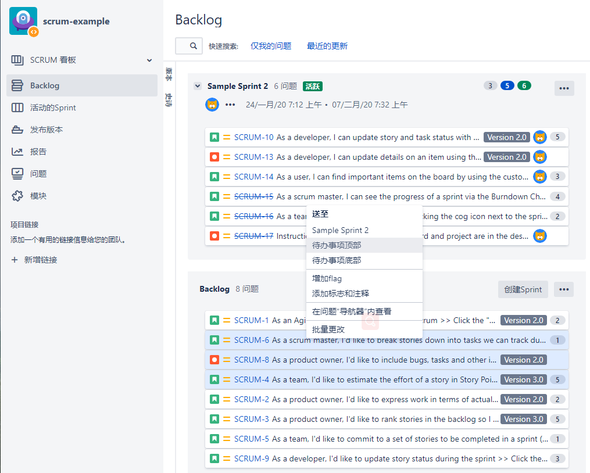
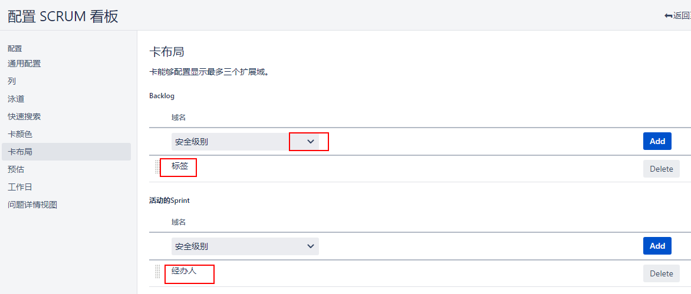
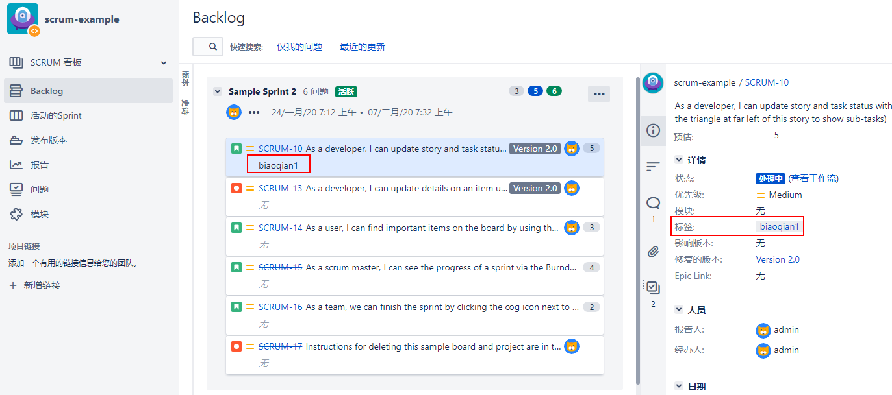

[TOC]

如果你正在使用Scrum或Kanplan，那么你日常工作的一大部分就是整理你的待办事项列表。

Jira的待办事项列表附带了几个方便的特性，可以帮助您避免将待办事项整理变成一项乏味的工作。要在您的backlog中对问题进行优先级排序，您只需将高优先级的问题向上移动，将低优先级的问题向下移动。

另一个有用的工具是标记重要问题或需要特别注意的问题的能力。

最后，您可以在backlog中显示关于问题的附加信息。可以是开箱即用字段中的数据，也可以是您创建的任何自定义字段。这方面的一个常见用例是显示添加到问题中的标签，因为标签是用户为各种目的向问题添加标签的一种简单方法。要向待办事项列表中的问题卡添加更多字段值，请遵循以下步骤:

- 从Backlog部分中选择您想要添加的字段。您最多可以添加三个字段。

