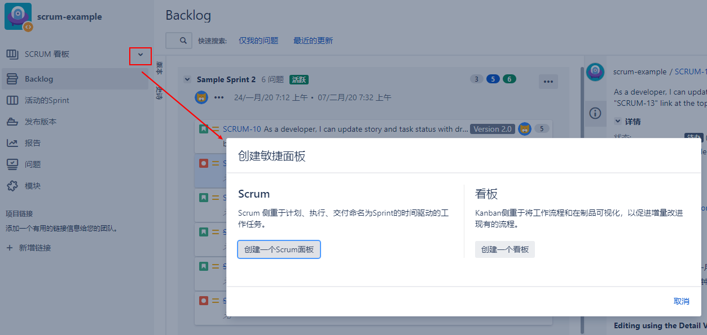

[TOC]

[TOC]

当你使用Scrum和看板项目模板创建一个新项目时，如本章前面所述，Jira会自动为你的项目创建一个敏捷板。除了这个默认的板，您还可以为您的项目创建额外的板。

例如，如果你创建了一个Scrum项目，并且你有两个团队在做这个项目，你可以为第二个团队创建一个新的Scrum board，这样每个团队都可以使用他们自己的敏捷板，而不会互相妨碍。另一个例子是，如果你的第二个团队需要使用看板来运行他们的部分项目，那么你可以很容易地将一个新的看板添加到Scrum项目中，这样每个团队就可以在相同的项目中使用他们想要的敏捷方法。要在项目中添加新的敏捷板，请遵循以下步骤:

- 浏览项目的敏捷版。
- 从左上角单击当前板的名称并选择Create board选项。
- 选择你想要创建的敏捷板子类型，按照屏幕上的向导创建新板子

一旦创建了新的敏捷板，它将从左上角添加到敏捷板菜单中，您可以通过选择您想要的板子在板子之间进行切换。