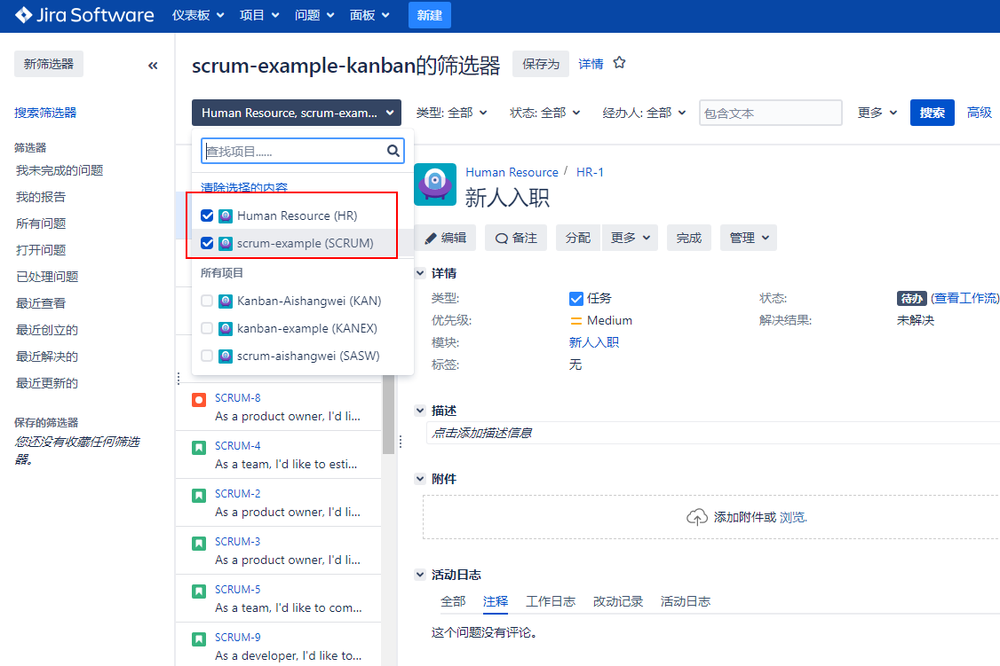

[TOC]

默认情况下，当您创建一个新项目时，所创建的敏捷板将只包含当前项目的问题。如果您的项目是自包含的，这通常没有问题;但是，在某些情况下，您可能有多个相互关联或相互依赖的项目，为了让您全面了解这些项目，您需要在一个敏捷板上显示所有这些项目的问题。

好消息是Jira允许您这样做。这里需要理解的一件事是，Jira使用所谓的过滤器来定义哪些问题将包括在黑板上。

因此，如果你想要在敏捷板中包含来自其他项目的问题，你所需要做的就是使用以下步骤来更新板:

板 -> 配置

>[info]因为过滤器需要与用户共享，以便让他们看到他们返回的问题，所以确保您的过滤器与板设置的相同的用户组共享。通常，您可以与项目共享筛选器。

