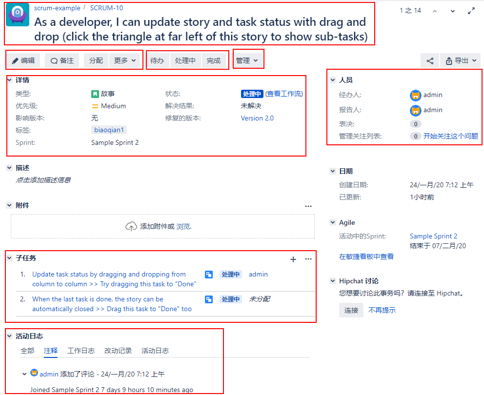

[TOC]

根据您使用Jira的方式，一个问题可以表示不同的东西，甚至在用户界面中看起来也可能非常不同。例如，在Jira核心中，一个问题将表示一个任务，它看起来像这样，如下面的屏幕截图所示:

尽管在一个问题可以代表什么和它可能的样子上有很多不同，对于Jira中的所有问题，都有一些共同的关键方面，如下所示:

- 一个问题必须属于一个项目。
- 它必须有一个类型，也称为问题类型，它指示问题所代表的内容。
- 它必须有一个 summary。summary的作用类似于对问题内容的一行描述。
- 它必须有一个状态。状态指示在给定的时间内问题在工作流的哪个位置。

Jira中的问题表示用户可以完成的工作单元，例如Jira Core中的任务、Jira软件中的故事或Jira服务台中的请求。这些都是问题的不同形式。

首先，让我们看看Jira核心中的一个问题。下面的屏幕截图显示了一个典型的问题示例，并将其分解为更容易理解的部分，然后解释表中每个突出显示的部分。这个视图通常被称为问题摘要或问题页面:

