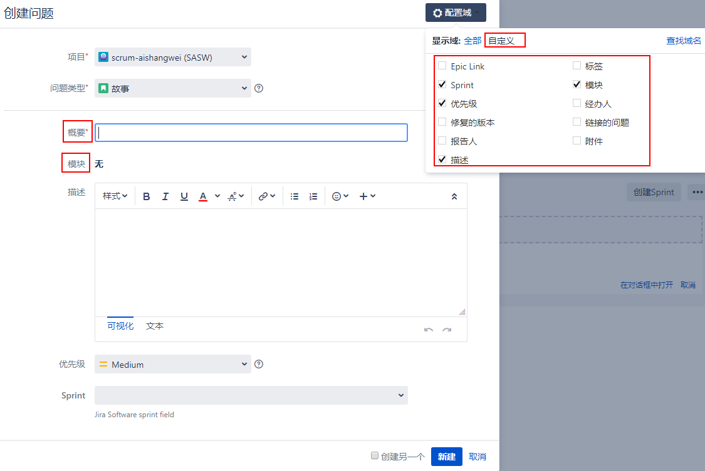
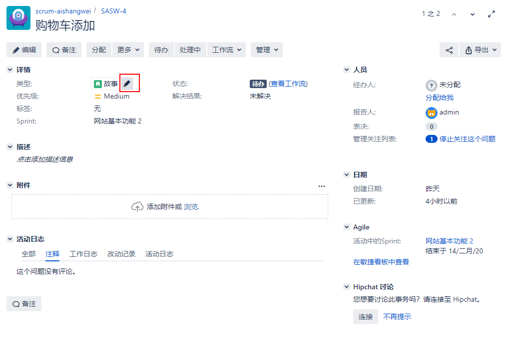
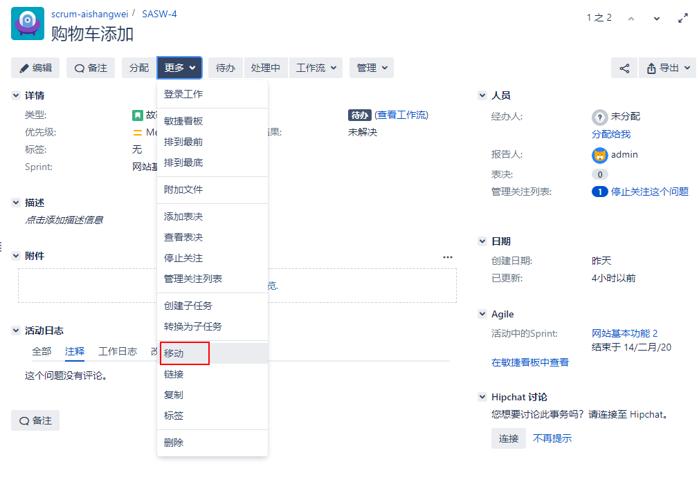
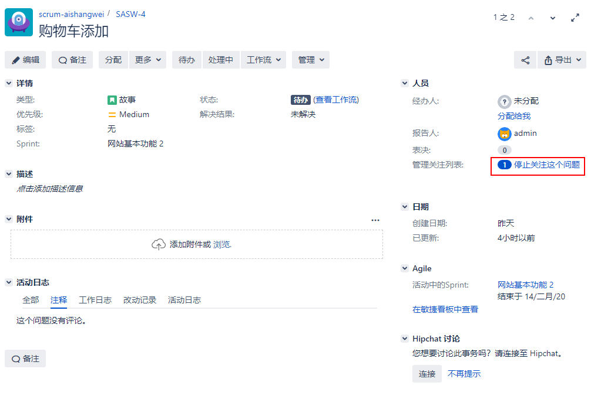
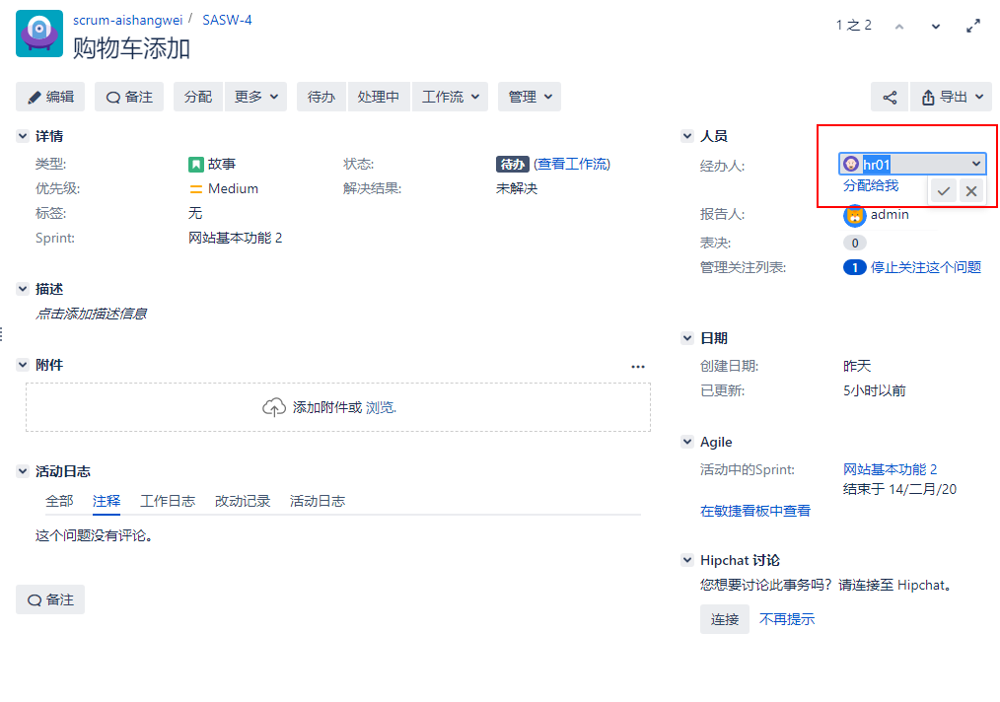
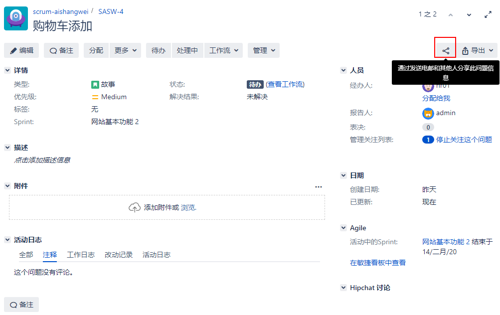

[TOC]

### 1. 创建问题

在创建新问题时，您需要填写许多字段。有些字段是强制性的，如问题的摘要和类型，而其他字段是可选的，如问题的描述。

如您所见，有相当多的字段，必填项目的名称旁边将有一个红色星号(*)标记。

>[info]除了以这种方式手动创建问题之外，您还可以使用高级工具，如问题导入器、Jira的REST api和电子邮件来创建问题。

管理员配置哪些字段将是create对话框的一部分，但作为用户，您可以通过执行以下步骤来隐藏可选字段，从而自定义和创建自己的create屏幕:

右上角的配置字段 -> 自定义

>[info]确保没有隐藏任何必填字段，否则将无法创建新问题。您只是为自己隐藏或显示这些字段。实际上，只有Jira管理员才能全局地隐藏和显示所有用户的字段。

在“创建”按钮旁边有一个“创建另一个”选项。通过勾选此选项，可以更快速创建更多的问题。

### 2. 编辑问题

在Jira中编辑问题有两种方法。

点击编辑按钮

使用内联方式

### 3. 删除问题

问题删除是永久的Jira。不像其他一些应用程序可能会将删除的记录放入垃圾桶中，检索已删除问题的惟一方法是从以前的备份中恢复Jira。

请按以下步骤删除问题:

选择问题 -> 更多 -> 删除

删除一个问题会从Jira中永久删除它，以及它的所有数据，包括附件和注释。

### 4. 在两个项目中移动问题

移动问题需要考虑的因素:

- 问题类型是否匹配
- 工作流和映射的问题是否一致
- 字段是否一致

Jira附带了一个向导，旨在帮助您解决所有这些问题。

通过以下步骤开始处理问题:

一旦问题被移动，它将根据新项目获得一个新的问题 key。如果您使用旧的问题 key 访问问题，Jira将自动重定向您。

### 5. 对一个问题进行投票

表达您对Jira问题的兴趣的最直接的方式是投票支持它。

一个例子是Atlassian如何使用Jira (`https://jira.atlassian.com/browse/JRASERVER-9`)作为一种方式，让它的客户选择和投票的功能，他们想要实现或bug要修复的投票，根据他们的需要问题。这使得产品管理和营销团队能够洞察市场需求以及如何最好地改进他们的产品。

投票时要记住的一件事是，每个问题只能投票一次。对于许多不同的议题，你可以投很多次票，但是对于任何给定的议题，你只能投一次票。这有助于防止单个用户对同一问题进行连续投票，这可能会影响投票结果。但是，你可以不投你已经投过的一票，以后再投;如果你选择这样做，它仍然只会算作一票。

要为某个问题投票，只需单击投票旁边的问题投票链接。当您为某个问题投票时，图标将显示为彩色。当您还没有为某个问题投票时，图标将显示为灰色。注意，你不能为你自己创造的问题投票。

### 6. 接收关于某个问题的通知

Jira能够向用户发送关于问题更新的自动电子邮件通知。一般情况下，通知邮件只会发送给事件的报告者、受让人以及对事件有兴趣的人。这种行为可以通过通知模式来改变。

您可以通过选择关注该问题来注册您对该问题的兴趣。通过关注问题，您将收到关于活动的电子邮件通知，如新评论和问题更新。关注问题的用户也可以选择停止 watch,从而停止接收来自Jira的电子邮件更新。您还可以通过将其他用户添加到观察者列表中来添加观察者。

要查看某个问题，只需单击“开始关注该问题”链接。如果你已经关注这个问题，它会改变，停止关注这个问题。如下面的截图所示:

>[success]Jira将自动将您添加为您创建的问题的观察者，或者您评论和更新的问题。

Jira还通过在watch图标旁边显示总关注者的人数，向您显示有多少人在积极关注这个问题。您可以单击观察者旁边的数字查看完整的观察者列表，并将新用户添加为问题的观察者。

### 7. 指定一个问题给用户

一旦创建了一个问题，通常分配给该问题的用户将开始处理它。之后，用户可以将问题进一步分配给QA人员进行进一步验证。

在许多情况下，需要将问题重新分配给不同的用户，例如，当前的assignee不可用时，或者在没有特定的assignee创建问题时。另一个例子是在工作流的不同阶段，问题被分配给不同的人。由于这个原因，Jira允许用户在问题创建之后重新分配它们。

通过以下步骤分配问题:

选择问题 -> 经办人

这个问题重新分配后，它的assignee值将更新到新用户。新员工还会收到一封通知电子邮件。

>[info]您可以按键盘上的I键来快速分配问题。

### 8. 共享一个问题给其它用户

如果您希望将某个问题通过电子邮件发送给Jira中的其他用户，而不是手动复制并粘贴问题的URL到电子邮件中，那么您可以使用Jira中内置的共享功能。

>[warning]如果与您共享问题的用户没有访问该问题的权限，他们将无法看到问题的详细信息。