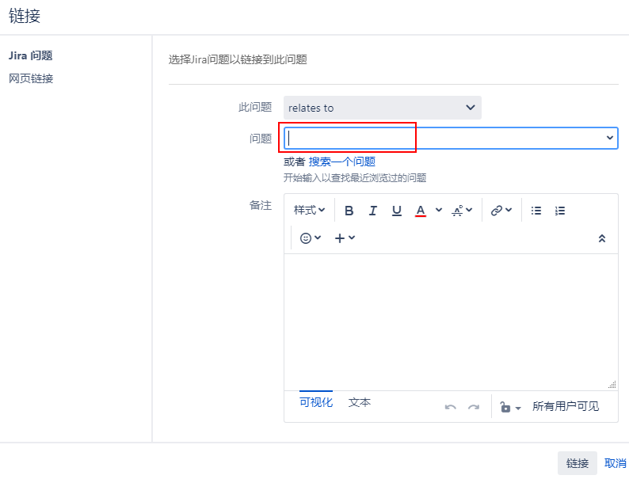
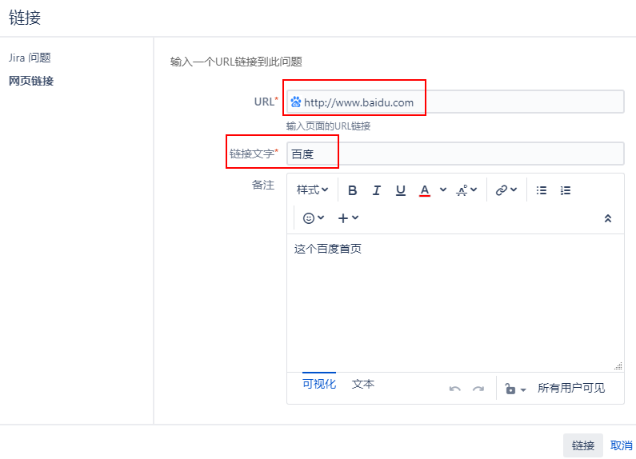
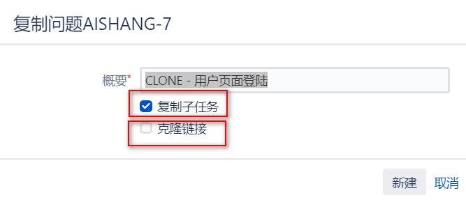

[TOC]

Jira允许您为问题创建自定义超链接。这使您能够提供有关此问题的更多信息。您可以创建两种类型的链接:

- 链接到Jira中的其他问题
- 链接到web上的任意资源，例如web页面。

### 1. 链接到其它问题

问题往往在某种程度上与其他问题相关。例如,问题A可能会阻塞问题B, C和D又有可能是重复的问题 .幸运的是，Jira通过标准的问题链接特性提供了一个优雅的解决方案。

问题详情页 -> 更多 -> 链接

从问题类型中，我们应该能看到7个选择性，并且其中有6个，都是双向性质的链接，双向性质绝对不是多余的。

比如：问题 `ABC-123 Block 问题 DEF-456` , 这个时候，你就无法确定 ABC Block DEF ,还是 DEF Block ABC ，这就是双向性质的用法所在。所以，在 Jira 中使用了这种双向特性，当你看到DEF-456上的链接时，你会看到“blocks by ABC-123”。

链接类型通常用于：
blocks：一个问题阻止另一个问题的进展
clones: 从一个问题进行复制
duplicates：这个问题之前已经有了，不需要重新解决了
relates to：两个问题之间有共同的内容，相互关联

链接了问题之后，它们将显示在视图问题页面的问题链接部分。Jira将显示目标问题的键、描述、优先级和状态。

>[info]关于链接类型解释：https://community.atlassian.com/t5/Jira-Service-Desk-questions/Link-types-in-Service-Desk/qaq-p/608009

### 2. 将问题链接到远程内容

标准的Jira问题链接允许您将多个问题链接到同一个Jira实例。Jira还允许您将问题链接到资源，例如internet上的web页面。

使用远程问题链接与标准问题链接非常相似;不同之处在于，不是选择另一个问题，而是指定目标资源的URL地址。

### 3. 克隆

当您需要创建一个新的问题，并且您已经有了一个基线问题时，Jira允许您通过克隆原始问题，使用现有问题的数据快速创建它。克隆问题允许您快速创建一个新问题，并填充其大部分字段。例如，您可能有两个具有相同bug的软件产品。在一个项目中创建bug报告之后，您可以简单地将其复制到另一个项目中。

一个克隆的问题将有所有的字段从原来的问题复制;然而，它是一个独立的实体。对这两个问题采取的进一步行动不会影响到另一个问题。

当一个问题被克隆时，会在两个问题之间自动创建一个克隆链接，从而建立一个关系。

在Jira中克隆一个问题是简单而直接的。您所要做的就是通过以下步骤为克隆的问题指定一个新的摘要(或接受前面有文本克隆的默认摘要):

成功克隆问题之后，将转到新克隆问题的问题摘要页面。

