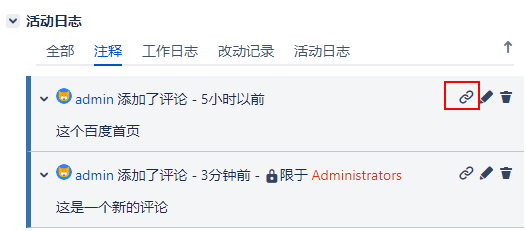

[TOC]

Jira 允许用户对问题创建评论（注释），您将能够在将问题分配给不同用户时创建评论。这是一个非常有用的特性，允许多个用户协作，以便他们可以处理相同的问题并共享信息。例如，支持人员(问题经办人，Assignee)可能会向问题`添加评论`来请求报告人（Reporter）进行更多的说明，与 Jira 的内置通知系统结合使用时，电子邮件通知将发送给问题的报告人，经办人和任何其他关注该问题的用户。

### 1. 添加评论

默认情况下，所有登陆用户都可以对他们可以访问的问题添加评论。

评论的问题 -> Comment 或键盘M

创建评论时，您可以选择谁可以查看此评论。特别是您可能只想与内部用户分享您的评论时，这将非常有用。

添加到问题后，您可以编辑内容和安全设置，也可以全部删除，只需要悬停评论。

### 2. 永久评论

有时，你会想让别人参考你之前的评论。你可以告诉他们这个问题，让他们向下滚动到最下面，直到他们在数百条评论中找到你的评论，Jira允许你创建一个快速链接到你的评论，将你直接带到感兴趣的评论。

问题的评论 -> 鼠标悬停 ->

把此链接拷贝给您的同事，他就可以直接看到您的评论。

### 3. 附件

到目前为止，我们已经看到，Jira 使用 Summary 和 Description 来填充问题，这适用于大多数情况，当有复杂的数据时，可能无法进行描述，这时就可以使用附件功能。

有两种方法可以实现，拖拽和点击浏览选项。

根据文件的类型，某些文件（例如图像和PDF）可以直接从 Jira 的UI中查看，而无需下载。