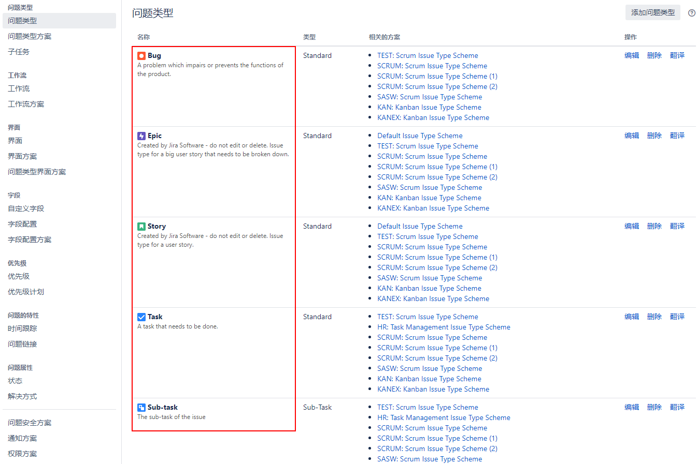
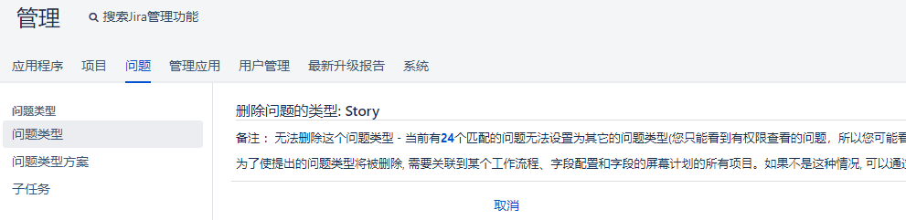
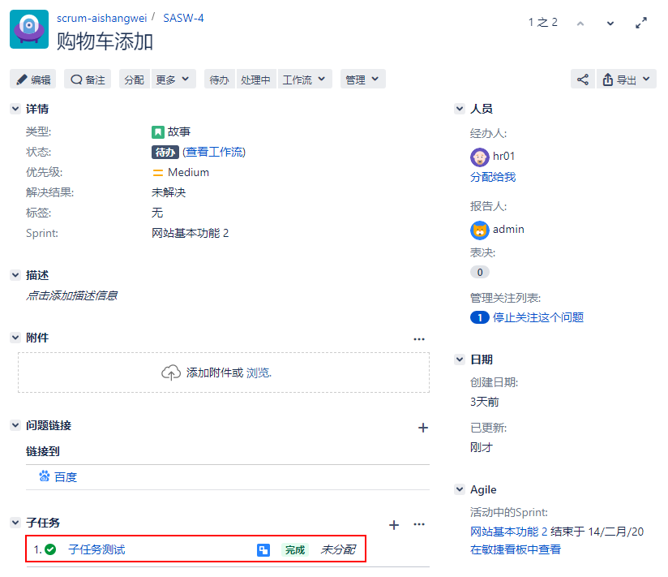
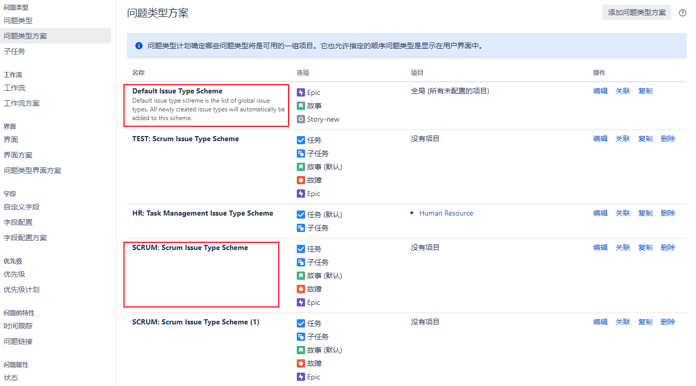
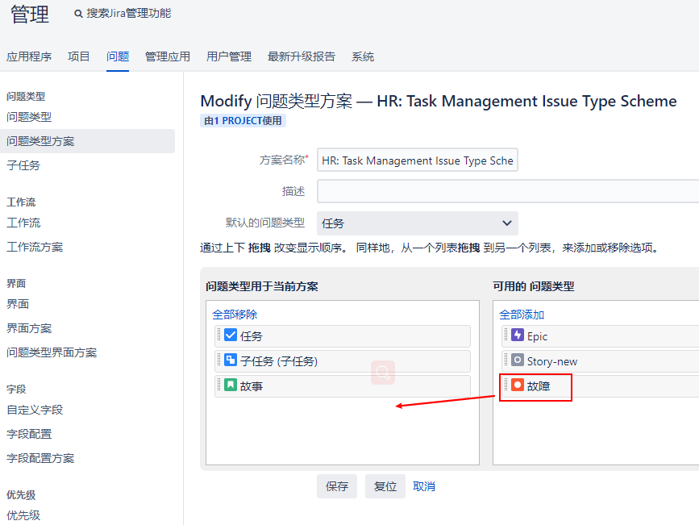
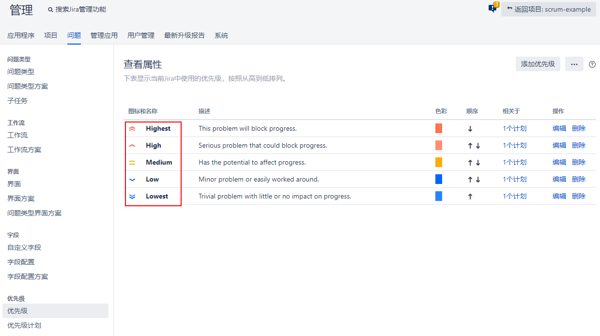
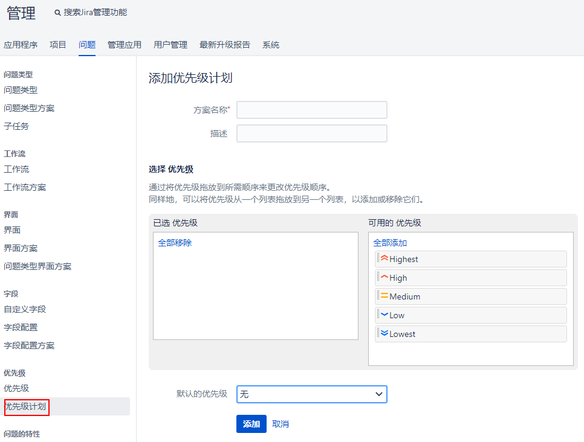

[TOC]

默认的问题类型非常适合简单的软件开发项目，但是它们不一定能满足其他人的需求。由于不可能创建一个能够满足每个人需求的系统，所以Jira允许您创建自己的问题类型并将它们分配给项目。

问题类型通过管理问题类型页面进行管理。请按以下步骤进入本页:

问题 -> 问题类型

下面的屏幕截图显示了Jira软件附带的默认问题类型列表:

### 1. 创建一个问题类型

您可以创建任意数量的问题类型。通过以下步骤创建一个新的问题类型:

问题 -> 问题类型 -> 添加问题类型 -> 新问题类型的名称和描述 -> 标准问题或子任务

创建新问题类型后，将为其分配一个默认图标。如果您想要更改图标，您将需要单击问题类型的Edit链接，然后选择一个新图像作为其图标。

### 2. 删除问题类型

在删除问题类型时，如果该问题类型已经在使用中，是无法进行删除的，因此，除非你对这些问题进行一个转移后，才能删除，正如我们在下面的屏幕截图中看到的，当我们删除`Story`问题类型时，Jira通知我们已经存在的24个问题。你需要将他们分配到一个新的问题类型:

### 3. 子问题

Jira一次只允许一个人(受让人)处理一个问题。这种设计确保了一个问题是可以针对一个人跟踪的单个工作单元。然而，在现实世界中，我们经常发现自己处于需要多人处理同一问题的情况。这可能是由于对任务进行了很差的分解，或者仅仅是因为手头任务的性质。不管是什么原因，Jira提供了一种通过子任务来解决这个问题的机制。

子任务在许多方面与问题相似，事实上，它们是一种特殊的问题。它们必须有一个父问题，并且它们的问题类型被标记为子任务问题类型。你可以说所有的子任务都是问题，但并不是所有的问题都是子任务。

对于每个问题，您可以有一个或多个子任务，它们可以彼此独立地分配和跟踪。子任务不能有其他子任务。Jira只允许一个级别的子任务。

#### （1）创建子任务

由于子任务属于问题，您需要先浏览到问题，然后才能通过以下步骤创建新的子任务。

具体的问题 -> 更多 -> 创建子任务

创建的页面与创建问题类似，不同的是，你无法选择哪个项目，这是因为Jira可以根据父问题确定项目的值。您还会注意到，您只能选择作为子任务的问题类型。

一旦创建了子任务，它将被添加到父问题的子任务部分。您将看到属于问题的所有子任务及其状态。如果一个子任务已经完成，它旁边会有一个绿色的标记，如下面的截图所示:

### 4. 问题类型方案

问题类型模式是可应用于项目的模板或问题类型集合。

正如下面的截图，Jira提供了一个默认的问题类型模式，它适用于没有应用特定问题类型模式的所有项目。当您创建一个新项目时，将根据您选择的项目模板为您创建一个新的问题类型模式。新方案还将基于模板预先填充问题类型。如下图所示，我们有两个问题类型方案，

当您创建自己的问题类型时，为了使它们可用，您需要将它们添加到项目使用的问题类型方案中。

### （1） 添加问题类型到问题类型方案

通过以下步骤创建一个新的问题类型方案:

问题 -> 问题类型方案 -> 选择要向添加问题类型的问题类型方案 -> 编辑 -> 拖动 问题类型

### 5. 问题优先级

优先级帮助用户设置问题的重要性。用户可以首先为问题分配优先级值，然后使用它们对必须处理的问题列表进行排序，从而帮助团队决定首先关注哪些问题。Jira有五个优先级，如下面的截图所示:

您可以通过创建自己的优先级来定制此列表。要创建新的优先级，请遵循以下步骤:

问题 -> 优先级 -> 新优先级名称和描述 -> 选择图标和颜色

#### （1）创建一个优先级方案

问题优先级在Jira中是全局使用的，因此所有项目都有相同的优先级选项集，尽管这是一个限制，当某些项目需要有自己的优先级选项集时，会造成不便。Atlassian在最近的Jira软件更新中已经解决了这个问题，所以优先方案的功能也包括在内。

优先级方案的工作方式与我们前面看到的问题类型方案特性相似。您可以创建一个方案，使它只包含您需要的问题优先级，然后将该方案应用于项目。这样，每个项目都有自己的优先级选项集。要创建和应用新的优先级方案，请遵循以下步骤:

问题 -> 优先级方案 -> 添加优先级方案 -> 填写优先级名称，选择可用的优先级，设置一个默认的优先级

一旦您创建了新的优先级方案，您就可以进入您的项目的设置页面，选择新的优先级方案，并应用该方案。