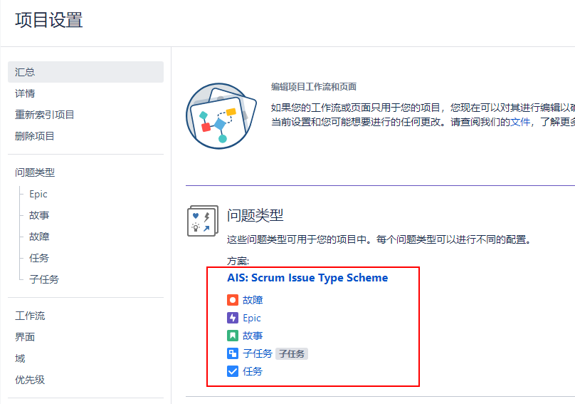
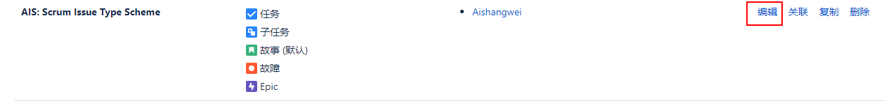
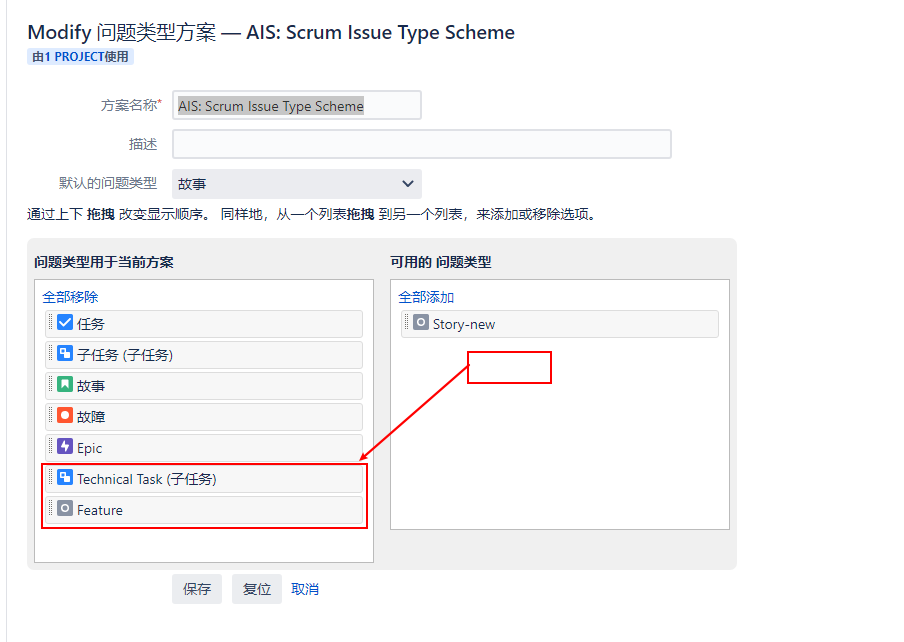

[TOC]

在本次练习中，我们将创建一个简单`软件开发项目`示例。我们将做以下演示：

- 创建一个类似 story 的新问题类型
- 把新问题类型添加问题类型方案中，并使其可用

### 1. 创建项目

项目名称：Aishangwei , key: AIS

查看现有的问题类型。项目设置 -> 汇总

### 2. 添加新的问题类型

虽然 Jira 的敏捷项目已经比较适合软件开发使用，但是有的时候我们往往会有自己的一些习惯，来进行自定义字段，这次，我们就创建两个新的问题类型：Feature（类似于 Story） 和 Technical Task (类似于子任务)。

问题 -> 问题类型 -> 添加问题类型

- 名称：Feature   类型：标准问题类型
- 名称：Technical Task   类型：子任务问题类型

### 3. 更新问题类型方案

由于我们仍然想保留之前的问题类型，不想影响目前已经有的问题，所以我们可以把新创建的问题类型更新到项目使用的现有问题类型方案，当然您也可以根据需求，自己新创建问题类型方案。

问题 -> 问题类型方案

### 4. 创建两个问题测试

分别创建两个问题：

Feature：用户数据库实现读写分离
Technial Task：新增5台读数据库