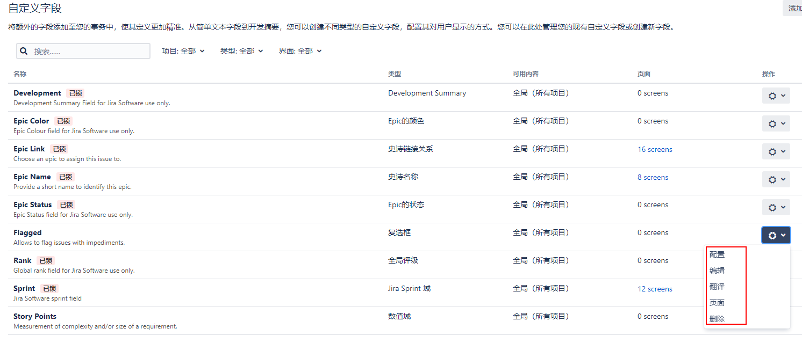
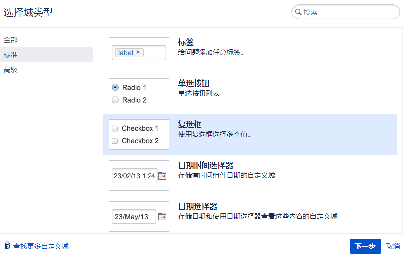
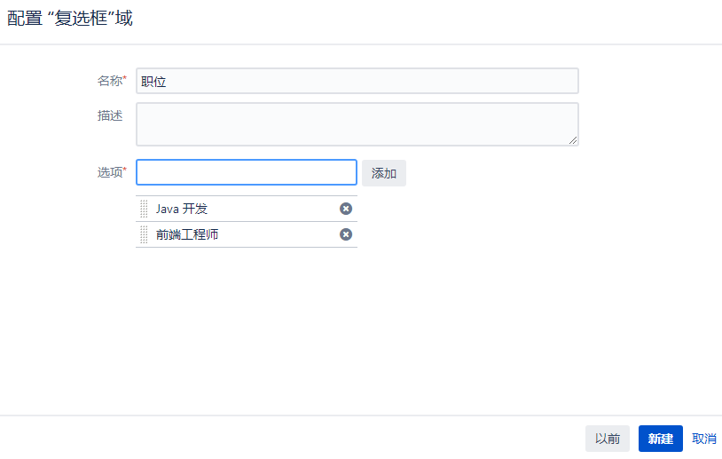
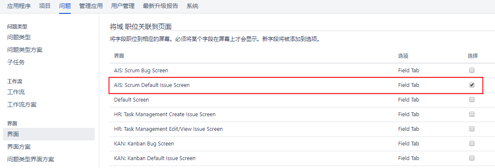
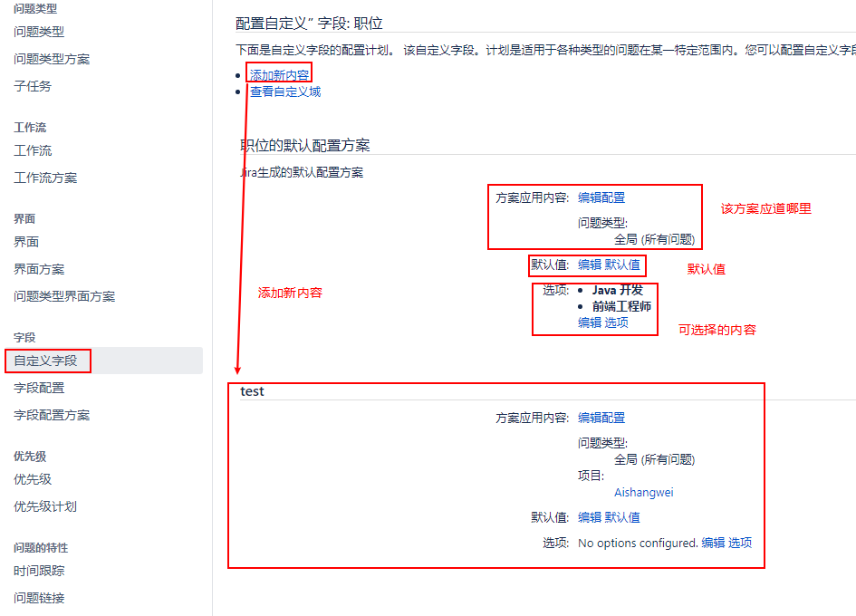

[TOC]

自定义字段是跨Jira全局使用的，因此您需要拥有Jira Administrator全局权限来执行创建和配置等管理操作。

Jira将所有自定义字段维护在一个集中的位置，以便于管理。执行以下步骤来访问自定义字段管理页面:

问题 -> 自定义字段

#### (1) 添加自定义字段

问题 -> 自定义字段 -> 添加自定义字段 -> 选择字段类型 -> 选择在哪个界面上使用，这个可选

一旦创建了自定义字段，在创建、编辑或查看问题时，您将在适当的屏幕上看到它。

#### (2) 编辑/删除自定义字段

一旦创建了自定义字段，就可以随时编辑其详细信息。您可能已经注意到，每个自定义字段都有一个配置选项和一个编辑选项。刚开始区分这两者可能会混淆。

Configure指定与自定义字段上下文相关的选项。

Edit为自定义字段指定跨Jira的全局选项;这些包括它的名字，描述和搜索模板:

在对自定义字段的搜索模板进行更改时，需要注意的是，虽然更改将立即生效，但您需要执行完整的系统重新索引，以便Jira返回正确的搜索结果。这是因为，对于每个搜索模板，底层的搜索数据结构可能不同，Jira需要为新应用的搜索模板更新其搜索索引。

>[info]您应该选择后台重新索引选项，以避免任何停机。

你也可以删除现有的自定义字段，如下:

问题 -> 自定义字段 -> 选择要删除的自定义字段

一旦删除，您将无法还原自定义字段，并且您将无法检索和搜索这些字段持有的数据。如果您尝试创建另一个具有相同类型和名称的自定义字段，它将不会继承前一个自定义字段的数据，因为Jira为每个自定义字段分配惟一的标识符。强烈建议在删除字段之前备份Jira项目，除非您绝对确定不需要它。

#### (3) 配置自定义字段

要配置自定义字段，您需要访问配置自定义字段页面，如下所示:

问题 -> 自定义字段 -> 配置

