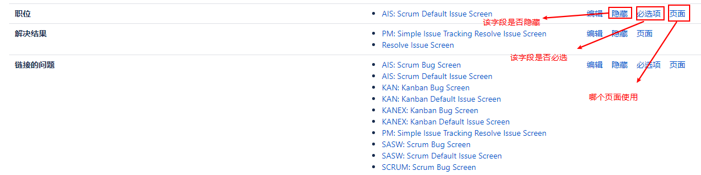
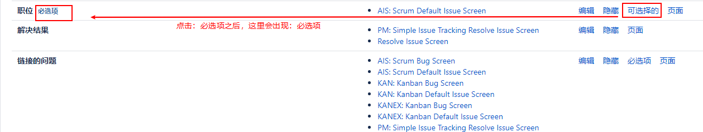

[TOC]

正如您已经看到的，字段用于捕获和显示Jira中的数据。字段也可以具有由字段配置定义的行为。对于Jira中的每个字段，您可以配置它的行为，如下所示:

- Field description:

- Visibility: 这决定了一个字段应该是可见的还是隐藏的。

- Required: 这指定在创建/更新问题时，字段是可选的还是必须有值。、

- Rendering: 这指定了如何为基于文本的字段呈现内容(例如，wiki呈现器或简单的文本呈现器)。

字段配置为您提供了对Jira中每个单独字段的控制，包括内置字段和自定义字段。

您可以通过Jira管理控制台访问字段配置管理页面:

问题 -> 字段配置

### 1. 添加一个字段配置

创建新的字段配置非常简单。所有你需要做的是指定的名称和一个简短的描述，为新的配置:

问题 -> 字段配置 -> 添加字段配置，字段名称：Feature

创建字段配置之后，在我们将它与字段配置方案关联之前，它不会被使用。

### 2. 管理字段配置

需要注意的是，如果一个字段同时设置为hidden和required，那么您的用户将无法创建或编辑问题，因此Jira将不允许您将一个字段设置为required(如果您已经将它设置为hidden)。

### 3. 字段请求

对于某些问题，您可以将某些字段设置为required或mandatory。这是一个非常有用的特性，因为它确保在用户创建问题时能够捕获关键信息

您已经看到了必填字段的作用。系统字段，例如摘要和问题类型，在Jira中是必需的(您不能更改它)。当您没有为必填字段指定值时，Jira将在字段下面显示一条错误消息，告诉您需要该值。

在Jira中添加新字段时，例如自定义字段，默认情况下它是可选的，这意味着用户不需要指定值。

您将注意到，将字段设置为required后，字段名称旁边将有一个红色的小型required文本标签。当您创建或编辑一个问题时，字段的名称旁边将有一个红色(`*`)字符。这是Jira表示字段是强制性的一种方式。

### 4. 字段可见性

Jira中的大多数字段可以隐藏在用户的视图中。当字段被设置为隐藏时，用户将不会在任何屏幕上看到字段，包括创建、更新和视图等问题。执行以下步骤以显示或隐藏字段:

问题 -> 字段配置

一旦一个字段被设置为隐藏，它将不会出现在屏幕上，你将无法搜索它。但是，您仍然可以使用诸如脚本之类的工具来设置隐藏字段的值。因此，隐藏字段用于存储自动化流程使用的数据。

并不是所有字段都可以隐藏。内置字段(如摘要和问题类型)不能隐藏。当您将字段设置为hidden时，将会报错，经验法则是，字段可见性将覆盖字段需求`。

>[danger]字段不能既是隐藏的又是必需的。

### 5. 字段渲染

渲染器控制一个字段在被查看或编辑时的显示方式。一些内置和自定义字段有多个呈现程序，对于这些字段，您可以选择使用哪个。

Jira有四个不同的渲染器:

- `Default text renderer`: 这是基于文本的字段的默认呈现器。内容以纯文本的形式呈现。如果文本解析为Jira问题 key，呈现程序将自动将其转换为HTML链接。

- `Wiki style renderer`: 这是一个增强的基于文本的字段渲染器。它允许您使用wiki标记来装饰文本内容。

- `Select list renderer`: 这是基于选择的字段的默认呈现器。它被呈现为一个标准的HTML选择列表。

- `Autocomplete renderer`: 这是一个增强的基于选择的字段渲染器，它提供了一个自动完成功能来帮助用户开始输入字段。

下表列出了所有可以配置特殊渲染的字段及其可用选项:

| 字段  | 可用的渲染器  |
| ------------ | ------------ |
| Description  | 这是一个维基风格的渲染器和默认的文本渲染器。  |
| Comment  | 这是一个维基风格的渲染器和默认的文本渲染器。  |
| Environment  | 这是一个维基风格的渲染器和默认的文本渲染器。  |
| Component  | 这是一个自动完成渲染器和选择列表渲染器。  |
| Affects version  | 这是一个自动完成渲染器和选择列表渲染器。  |
| Fix versions  | 这是一个自动完成渲染器和选择列表渲染器。  |
| 自由文本字段(无限文本)类型的自定义字段  | 这是一个维基风格的渲染器和默认的文本渲染器。  |
| 文本字段类型的自定义字段  | 这是一个维基风格的渲染器和默认的文本渲染器。  |
| 多选类型的自定义字段  | 这是一个自动完成渲染器和选择列表渲染器。  |
| Version Picker 类型的自定义字段  | 这是一个自动完成渲染器和选择列表渲染器。  |

还有其他由第三方供应商开发的定制渲染器。与自定义字段一样，这些字段也打包为可以安装在Jira中的附加组件。一旦安装，这些自定义渲染器将可用于选择适当的字段类型。

一个很好的例子是`JEditor add-on`，它为所有基于文本的字段(包括Description)提供了富文本编辑器。

### 6. Screens

为了在`查看、创建或编辑问题时`显示字段，需要将其放在界面上。

在创建新的自定义字段时，您已经看到了这一点。

还有一个需要注意的是：在`字段配置中隐藏字段`和`不在屏幕上显示字段`之间有一个细微的区别。

虽然最终结果将是类似的，在这两种情况下，字段不会显示，但如果您隐藏了一个字段，您仍然可以通过使用默认值为它设置一个值，工作流后功能，或自定义脚本，本质上意味着字段在那里，但只是隐藏。

但是，如果字段不在屏幕上，则无法设置其值，因此可以认为它不是问题的一部分。另一个不同之处在于，隐藏字段将会隐藏所有添加了字段的屏幕，对于使用字段配置的项目。