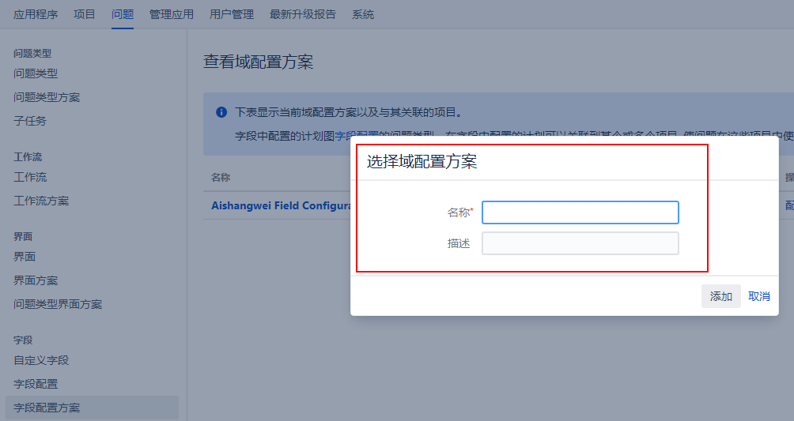
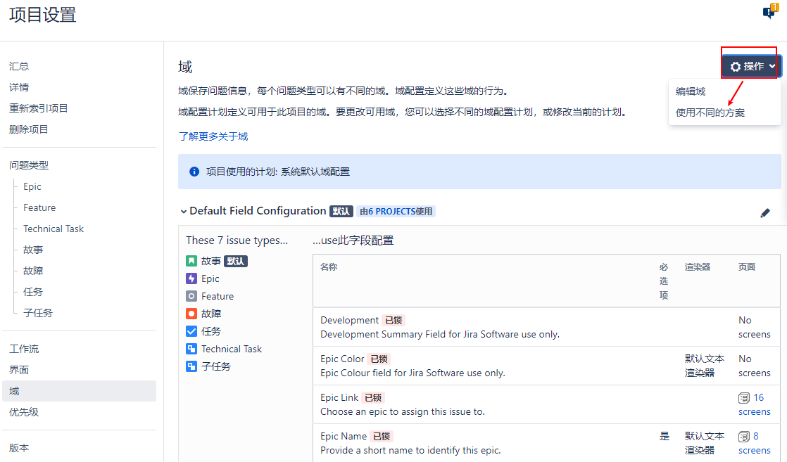

[TOC]

对于多个字段配置，Jira决定何时通过字段配置方案应用每个配置。

这允许您对映射到问题类型的多个字段配置进行分组，并一次性将它们应用到项目中。然后，项目将能够根据问题的性质确定应用哪个字段配置。

将配置分组到方案中还为您提供了重用现有配置而不重复工作的选项，因为每个方案都可以重用并与多个项目相关联。

### 1. 管理字段配置方案

问题 >字段配置方案   ，从这里可以 配置、编辑、删除和复制方案:

### 2. 添加一个字段配置方案

要创建一个新的字段配置方案，您所需要做的就是指定该方案的名称和一个可选的描述:

由于字段配置方案适用于项目，所以最好根据项目来命名它们。

### 3. 配置字段配置方案

对于每个字段配置方案，一个问题类型只能映射到一个字段配置，而每个字段配置可以映射到多个问题类型。

>[info]一个问题类型只能映射到一个字段配置。

问题 -> 字段配置方案 -> 配置

您可以重复这些步骤来为其他问题类型添加更多的映射。所有未映射的问题类型都将使用默认映射。

### 4. 将字段配置方案与项目关联

创建一个新的字段配置方案并建立映射之后，最后一步是将该方案与一个项目关联起来，以便配置生效。

需要注意的是，一旦您将字段配置方案与项目关联起来，您不能删除它，直到您删除所有的关联，使该方案再次成为不活动。

项目配置 -> 字段

>[success]您可以单击每个字段配置来查看它们的详细信息。