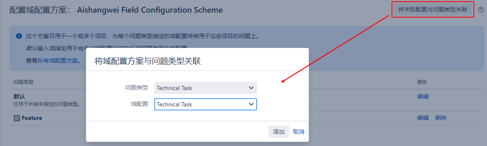
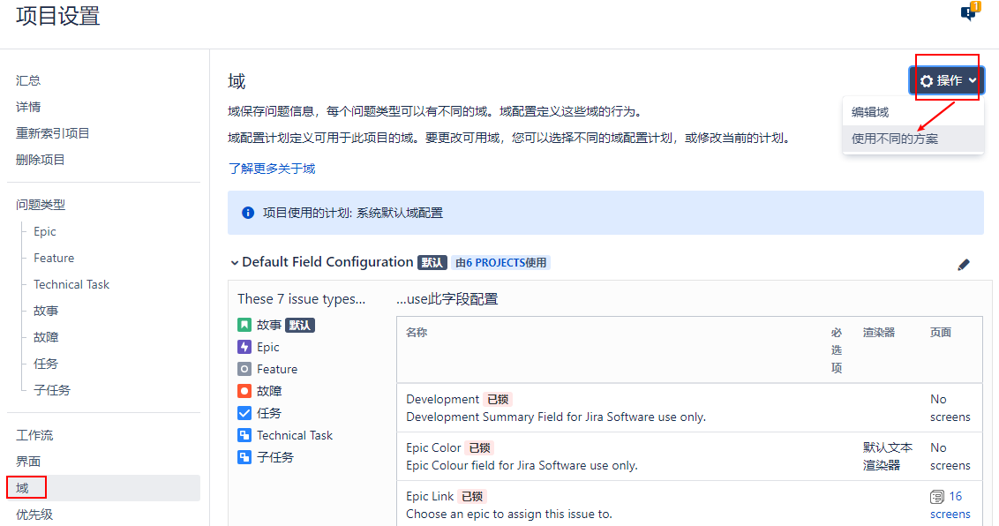

[TOC]

### 1. 创建自定义字段

问题 -> 自定义字段 -> 字段名： 主管

### 2. 字段配置

问题 -> 字段配置 -> 名称：Techical Task -> 选择字段：主管

### 3. 字段配置方案

问题 -> 字段配置方案 -> Aishangwei Field Configuration Scheme , 配置

### 4. 项目更新字段配置方案

